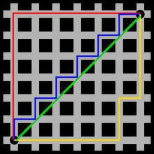
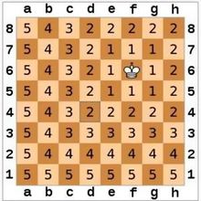

# DBSCAN  密度的聚类算法

> 参考 http://www.jianshu.com/p/e8dd62bec026

DBSCAN算法中将数据点分为一下三类：

1.  核心点。在半径Eps内含有超过MinPts数目的点
2.  边界点。在半径Eps内点的数量小于MinPts，但是落在核心点的邻域内
3.  噪音点。既不是核心点也不是边界点的点


DBSCAN算法的显著优点是聚类能够有效处理噪声点和发现任意形状的空间聚类.

# DBSCAN 下的第三个参数 距离对象算法

1. 欧几里德距离(默认) - Euclidean

```
    欧几里德算法又称辗转相除法，是指用于计算两个正整数a，b的最大公约数。应用领域有数学和计算机两个方面。
    
    计算公式gcd(a,b) = gcd(b,a mod b)。
    
    
```
  PHP-ML 中的 应用 如 [欧几里德距离](./euclidean.php)
  
2. 曼哈顿距离 - Manhattan

   

   图中红线代表曼哈顿距离，绿色代表欧氏距离，也就是直线距离，而蓝色和黄色代表等价的曼哈顿距离
    
   PHP-ML 中的 应用 如 [曼哈顿距离](./euclidean.php)
   
3. 切比雪夫距离 - Chebyshev distance 

    
    
```
国际象棋玩过么？国王走一步能够移动到相邻的8个方格中的任意一个。
那么国王从格子(x1,y1)走到格子(x2,y2)最少需要多少步？自己走走试试。
你会发现最少步数总是max( | x2-x1 | , | y2-y1 | ) 步 。
有一种类似的一种距离度量方法叫切比雪夫距离。
　　(1)二维平面两点a(x1,y1)与b(x2,y2)间的切比雪夫距离
　　(2)两个n维向量a(x11,x12,…,x1n)与 b(x21,x22,…,x2n)间的切比雪夫距离
　　这个公式的另一种等价形式是
       看不出两个公式是等价的？提示一下：试试用放缩法和夹逼法则来证明。

　　(3)Matlab计算切比雪夫距离

　　例子：计算向量(0,0)、(1,0)、(0,2)两两间的切比雪夫距离

　　X = [0 0 ; 1 0 ; 0 2]

　　D = pdist(X, 'chebychev')

　　结果：
　　D = 1     2     2

```
  PHP-ML 中的 应用 如 [切比雪夫距离](./euclidean.php)
